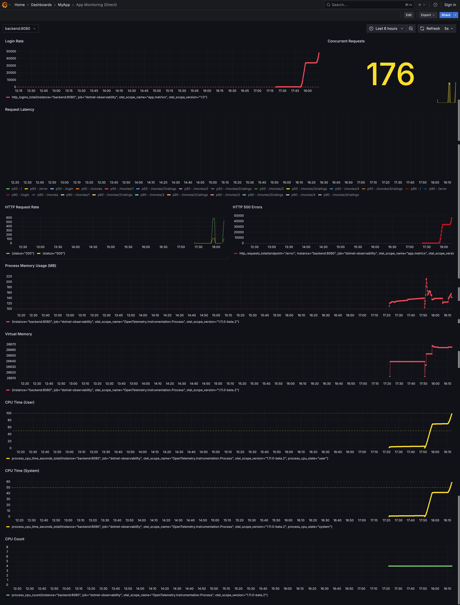
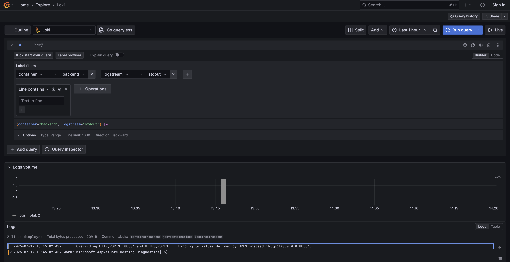

# 📊 Grafana Setup for Prometheus & Loki

## 📄 Deskripsi

Folder ini berisi file konfigurasi untuk mengatur **Grafana** dengan data source dari **Prometheus**, **Jaeger**, dan **Loki**. Tujuannya adalah untuk menarik metrik, tracing, dan log, lalu menampilkannya dalam bentuk dasbor yang mudah dipantau.

---

## 📦 File yang Tersedia

### 1. `provisioning/datasources/prometheus.yml`

**Deskripsi**:
Mengonfigurasi Grafana untuk menyambung ke Prometheus, Jaeger, dan Loki sebagai sumber data.

**Penggunaan**:
Tempatkan file ini di direktori `provisioning/datasources/`. File akan dibaca saat Grafana start.

**Cuplikan**:

```yaml
apiVersion: 1

datasources:
  - name: Prometheus
    type: prometheus
    uid: prometheus
    access: proxy
    orgId: 1
    url: http://prometheus:9090
    basicAuth: false
    isDefault: true
    jsonData:
      httpMethod: GET

  - name: Jaeger
    type: jaeger
    uid: jaeger
    access: proxy
    url: http://jaeger:16686

  - name: Loki
    type: loki
    uid: loki
    access: proxy
    url: http://loki:3100
```

**Penjelasan**:

* `uid`: unik ID untuk tiap sumber data
* `url`: alamat container Prometheus, Jaeger, atau Loki
* `isDefault`: jika `true`, data source ini akan digunakan default

---

### 2. `provisioning/dashboards/dashboard.yml`

**Deskripsi**:
Mengatur file dasbor apa saja yang dimuat otomatis oleh Grafana.

**Penggunaan**:
Tempatkan di `provisioning/dashboards/`.

**Cuplikan**:

```yaml
apiVersion: 1
providers:
  - name: 'App Dashboards'
    folder: 'MyApp'
    type: file
    disableDeletion: false
    editable: true
    options:
      path: /var/lib/grafana/dashboards
```

**Penjelasan**:

* `folder`: nama folder di dalam UI Grafana
* `path`: lokasi file JSON dashboard

---

## 🚀 Cara Menjalankan

1. **Pastikan Prometheus, Jaeger, Loki, dan Grafana sudah berjalan** (gunakan `docker compose up -d`)
2. **Akses Grafana**: [http://localhost:3000](http://localhost:3000)
3. **Cek Data Sources**:

    * Settings → Data Sources → Harus terlihat: Prometheus, Jaeger, Loki

---

## 📈 Cara Menggunakan Grafana untuk Metrik (Prometheus)

1. Masuk menu **Explore**
2. Pilih data source: `Prometheus`
3. Masukkan query metrik, contoh:

```promql
http_server_duration_seconds_count
```

4. Filter berdasarkan label seperti `app`, `instance`, dll

---

## 📄 Cara Menggunakan Grafana untuk Log (Loki)

1. Masuk menu **Explore**
2. Pilih data source: `Loki`
3. Query log menggunakan **LogQL**. Contoh:

```logql
{job="docker"}
```

Atau filter berdasarkan container name:

```logql
{container_name=~"backend|movies|ratings"}
```

4. Gunakan fitur pencarian `|~ "error"` untuk cari log error, misalnya:

```logql
{container_name="backend"} |= "error"
```

5. Klik satu baris log untuk melihat detail isi JSON log
6. Anda bisa membuat **dashboard panel** dari query ini (klik "Add to dashboard")

---

## 🧪 Pilih Aplikasi

| Aplikasi | Port |
| -------- | ---- |
| backend  | 8080 |
| movies   | 8080 |
| ratings  | 8080 |

---

## 📌 Catatan

* Pastikan Prometheus dan Loki dapat diakses oleh Grafana
* Jika log tidak muncul di Loki:

    * Periksa `promtail/config.yml`
    * Pastikan path container log benar (`/var/lib/docker/containers/.../*.log`)
    * Cek log Promtail: `docker compose logs promtail -f`

---

## 🖼️ Cuplikan Dashboard

### Metrik



### Log


