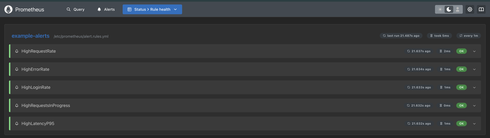
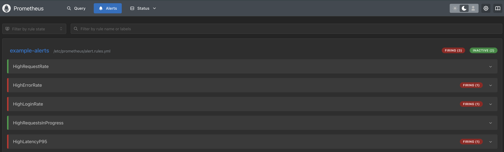
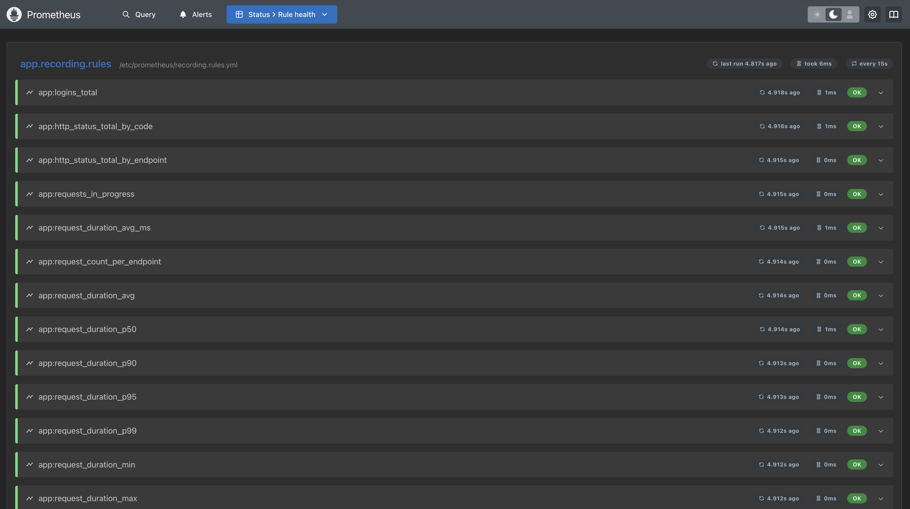
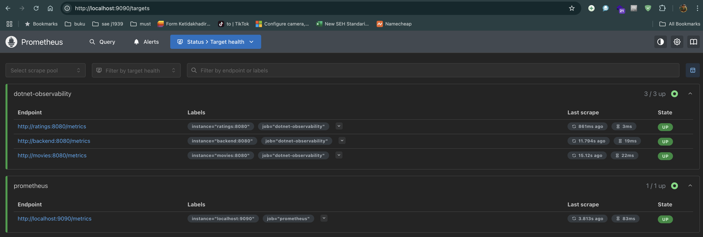

# Konfigurasi Prometheus

## Deskripsi

Pada folder ini berisi file-file konfigurasi yang diperlukan untuk menjalankan dan mengonfigurasi Prometheus dalam memantau dan mengelola metrik aplikasi. File-file yang terdapat di dalam direktori ini penting untuk pengaturan Prometheus, perekaman metrik, dan aturan pemberitahuan (alerting).

## File yang Tersedia

1. prometheus.yml  
   •	`Deskripsi`: Ini adalah file konfigurasi utama untuk Prometheus. Di dalamnya, Anda dapat menentukan pengaturan untuk server Prometheus, seperti interval scraping, target yang akan di-scrape, dan berbagai pengaturan lainnya untuk pengumpulan serta penyimpanan data time series.  
   •	`Bagian Penting`: 
   * `global`: Mengatur pengaturan global seperti interval scraping dan interval evaluasi.
   * `scrape_configs`: Menentukan target yang akan di-scrape oleh Prometheus. Setiap target mewakili endpoint yang akan dipantau untuk mengumpulkan metrik.
   * `alerting`: Mengonfigurasi aturan pemberitahuan dan pengaturan Alertmanager. 
   
   • `Pnggunaan`:
   * Tempatkan file ini di direktori utama server Prometheus. 
   * Jalankan Prometheus menggunakan konfigurasi ini untuk mulai mengumpulkan data dan menyimpan metrik.

Contoh cuplikan:

```yaml
global:
scrape_interval: 15s # untuk local testing

scrape_configs:
   - job_name: 'dotnet-observability'
     metrics_path: /metrics
     static_configs:
        - targets: ['backend:8080']
        - targets: ['movies:8080']
        - targets: ['ratings:8080']
   - job_name: prometheus
     static_configs:
        - targets: ['localhost:9090']
```

2. alert.rules.yml  
   `Deskripsi`: File ini berisi aturan-aturan pemberitahuan (alerting rules) yang digunakan oleh Prometheus. Aturan ini mendefinisikan kondisi-kondisi tertentu yang harus dipenuhi untuk mengirimkan pemberitahuan, seperti saat metrik tertentu melebihi ambang batas yang telah ditentukan.  
   `Penggunaan`:
   * File ini dapat dimuat ke dalam konfigurasi Prometheus untuk menjalankan pemberitahuan berdasarkan kondisi metrik tertentu.
   * Anda bisa menambahkan berbagai aturan di dalamnya, misalnya untuk mengirimkan pemberitahuan saat penggunaan CPU terlalu tinggi atau saat aplikasi tidak merespons.

Contoh cuplikan:
```yaml
groups:
- name: example_alerts
  rules:
   - alert: HighCpuUsage
     expr: avg(rate(cpu_usage[5m])) by (instance) > 0.9
     for: 5m
     labels:
     severity: critical
     annotations:
     summary: "CPU usage is high on {{ $labels.instance }}"
```

3. recording.rules.yml  
`Deskripsi`: File ini berisi aturan perekaman (recording rules) untuk Prometheus. Aturan ini memungkinkan Anda untuk membuat metrik baru berdasarkan perhitungan metrik yang ada, yang kemudian dapat digunakan untuk analisis lebih lanjut atau dipublikasikan ke sistem lain.  
`Penggunaan`: Anda dapat menggunakan file ini untuk mendefinisikan metrik yang lebih kompleks, seperti menghitung rata-rata atau jumlah agregat dari metrik yang ada.
Metrik hasil perekaman ini dapat digunakan untuk visualisasi di Grafana atau untuk analisis lebih lanjut.

Contoh cuplikan:

groups:
```yaml
- name: example_recording
  rules:
   - record: job:http_requests:rate5m
     expr: rate(http_requests_total[5m])
```

Cara Penggunaan
1.	Instalasi Prometheus:  
•	Pastikan Anda sudah menginstal Prometheus di server Anda. Anda dapat mengunduh Prometheus dari situs resmi Prometheus.
   2.	Konfigurasi Prometheus:  
   •	Tempatkan file prometheus.yml di direktori konfigurasi Prometheus.  
   •	Sesuaikan `scrape_configs` di dalam file prometheus.yml dengan target yang ingin Anda pantau.   
   •	Jika Anda ingin mengaktifkan pemberitahuan, masukkan file alert.rules.yml dalam konfigurasi Prometheus Anda.  
   •	Untuk perekaman metrik, masukkan file recording.rules.yml.
3.	Menjalankan Prometheus:
   Jalankan Prometheus dengan menggunakan perintah berikut:

```shell
prometheus --config.file=prometheus.yml
```
4. Monitoring dan Pemberitahuan:
   Selah Prometheus berjalan, Anda dapat mengakses web UI Prometheus di http://localhost:9090 untuk memverifikasi metrik dan aturan yang telah diterapkan.  
   Jika pemberitahuan diaktifkan, Anda dapat mengonfigurasi Alertmanager untuk menangani pemberitahuan yang dihasilkan berdasarkan aturan yang ada di alert.rules.yml.

Catatan  
•	Pastikan untuk menyesuaikan `scrape_configs` di dalam `prometheus.yml` agar Prometheus dapat memantau endpoint yang sesuai.  
•	Anda bisa menyesuaikan file aturan pemberitahuan dan perekaman sesuai kebutuhan pengujian atau pemantauan metrik aplikasi Anda.



